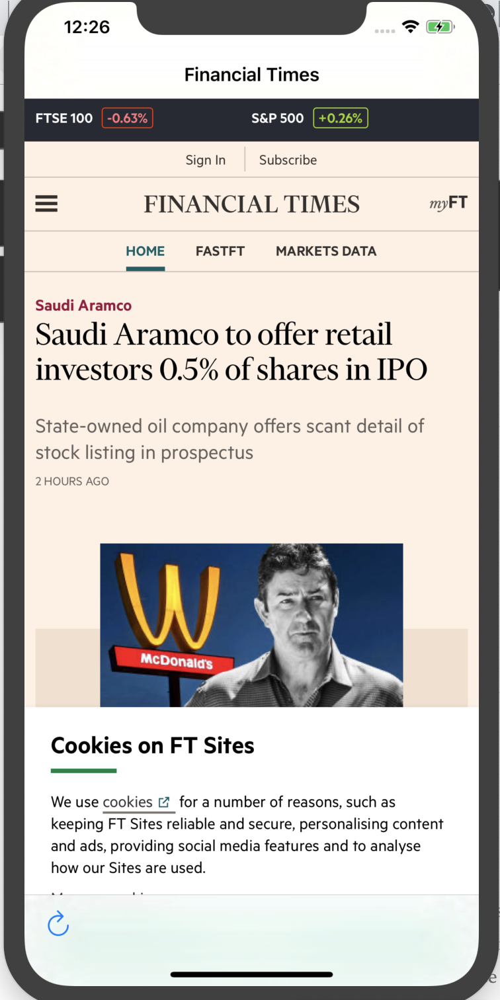

# WebView Exploration

Investigation of WebView technology and best practices for hybrid app development in 2019 / 2020.

### Project Goals:

1. Understand what a WebView is and how it can enable web technologies to be used in a native app
2. Understand the pros and cons of a hybrid WebView approach for modern app development
3. Work towards a hybrid app project that can be used as a simplified environment for exploring ideas and technologies.

### Quick Start:

#### How to start this iOS project:

-   Fork this project in the GitHub UI
-   Clone your forked copy `git clone https://github.com/[YOUR-USERNAME]/webview-exploration`
-   Open the project in Xcode (v11.2)
-   Click ▶️ to build and run the current scheme
-   You can edit the URL loaded in the WebView via the variable set in the `ViewController.swift` file

### Investigation

#### Iteration 1 - Web Browser in Native App:

1. Set up a single view iOS app and load in a live webpage in a WebView using the WebKit `WKWebView`.
2. Include a NavigationController with a refresh button to reload the web content.
3. Screen header displays website title.

First iteration in Xcode simulator: 

### Why even build a mobile app:

1. Because your competition has one.
2. Users make repeated use of your product on the go so an icon on the home screen of the device in their pocket is convenient.
3. Something about your product requires integration with a mobile operating system.

### Definitions:

_Webview_: WebViews are exactly what they sound like—a small view to a piece of Web content. A WebView can be a tiny part of the app screen, as shown in Figure 1, a whole page, or anything in between.

_Hybrid_: standard native apps where a significant portion of the content is rendered using web technology

_Web driven WebView app_: create a wrapper—the visual and technical container for the app—that is native, and fill all the content areas with WebViews. This is actually common - Facebook, Evernote, Instagram, LinkedIn, Uber, Slack, Twitter, Gmail, the Amazon Appstore, and many others are or have been WebView apps. For example, you could have a native wrapper that provides native functionality for tab-bar overflow and search input but web formatted content in the middle of the viewport.

_Wrapper_: simply all the code that wraps around the content on a page. There’s generally the wrapper is in native code and the page’s content mostly using Web technology. It’s not just the presentation layer. The native app handles things such as interacting with the phone to accept and send data, read settings, cache and store data, and use sensors. You can add anything to this wrapper.

_Router_: most native navigation will be handled via URL. The router will decide what to do with each URL. It may open the url in Safari if it’s for another domain, display a media viewer if it’s an image/video, or in the common case, create a new view controller to display. On iOS at least, the router hands off a view controller off to the Navigator which handles the presentation.

_Bridge_: an umbrella term for all the various parts of the app involved in native→web (or web→native) communication. E.g. this can be a javascript file that is embedded in the app and injected into the web view using `WKUserScript`. It would then give the native code or 'wrapper' an API for communicating with the web view without needing to directly query the DOM or do complex JS. Then using a `WKScriptMessageHandler`, we can respond to messages sent from the web view through the bridge.

_UIKit_: Framework in iOS for the basic behaviour of an app. Enables you to implement the interface, the event handling infrastructure for Multi-Touch and other types of input in the app, and the _main run loop_ needed to manage interactions between the user, the system and the app. UIKit manages your app's interactions with the system and provides classes to manage the app's data and resources.

It's the core objects needed to build an app for iOS - or a framework. The objects are used for displaying content on screen, interact with the content and manage interactions with the system.

_View Controllers_: An aspect of the UIKit framework that help you manage the views and structure your app. Views themselves help you display content on screen and facilitate user interaction.

### Native Apps:

#### Pros:

1. Better security
2. Best performance of the three approaches
3. Native apps are interactive, intuitive, and run more smoothly in terms of user input and output
4. Marketing and discoverability from the native app stores
5. Better user experience as the flow will bemore natural because of each mobile operating system’s specific UI guidelines and standards

#### Cons:

1. More complex / separate code bases per OS

Note - React Native is often considered more of a hybrid approach as it is another layer between the code and the OS / platform. When a new OS feature is released you have to wait for it to be supported by the hybrid framework.

### Hybrid Apps:

Handling navigation / linking can be odd. If you're not careful with your URLs users can suddenly pop out in a web browser. Native shell or wrapper is downloadable and loads the web features / code via a WebView.

#### Pros:

1. Don't need a browser (unlike purely web apps)
2. Access to the device’s internal APIs and hardware.
3. Great for presenting data already formatted in HTML (rather than reformatting in native code).
4. You are not limited to particular platform choices, so can react more quickly to changes or problems. You can even shift platforms when issues arise. If you’re having a problem with a piece of native code, you might be able to address it temporarily by switching to a WebView.
5. Flexability - you don’t have to commit to using Web content everywhere. As I mentioned for smaller WebViews, if something would be terrible as a Web interface, just build that page partially or entirely as a native screen.

#### Cons:

1. Slower than native apps
2. ** You’re dependent on a third-party platform to deploy the app’s wrapper ** Is this the case? What platform? Is this the native store?
3. The mixed code base means you have to contend with issues that stem from both native systems and hybrid systems, which makes bug fixing more difficult
4. Increasing customisation can make things incrementally more complex and steers closer to a native app.

### Web Apps:

#### Pros:

1. Single code base
2. Updates don't have to go through the app store, so use doesn't have to manage updates themselves
3. Updates can be released any time as don't have to go through app store approval
4. Built for all platforms as run in any browser

#### Cons:

1. Very limited scope when it comes to leveraging device features and hardware
2. Poor discoverablility if not in the native app stores
3. Less intuative and interactive than native apps
4. Slower and much less responsive than native apps
5. Require a browser and users use different ones so harder to track usage patterns etc

### References:

-   https://www.uxmatters.com/mt/archives/2018/08/mobile-apps-native-hybrid-and-webviews.php
-   https://m.signalvnoise.com/basecamp-3-for-ios--hybrid-architecture/ - explanation with screenshots detailing how Basecamp's hybrid app archietecture works and hits the user.
-   https://clearbridgemobile.com/mobile-app-development-native-vs-web-vs-hybrid/#Web_vs_Native_vs_Hybrid_Infographic - architecture decision making diagram
-   https://www.mobiloud.com/blog/native-web-or-hybrid-apps/ - longer read on the pros and cons

### Interesting Tools and Ideas:

-   https://github.com/turbolinks/turbolinks-ios - used by Basecamp
-   Basecamp's approach is web first thanks to their hybrid app stack. Then by default, we have a view controller that can display any url in Basecamp 3, so any new urls will just work in the app. We can iterate and experiment on the web, ship immediately on all platforms, and later make it native if feel we can improve the experience
-   Audio player in Swift - uses AVAudioPlayer framework from [AV Foundation](https://developer.apple.com/av-foundation/) - https://codewithchris.com/avaudioplayer-tutorial/
    -   Background audio - https://developer.apple.com/documentation/avfoundation/media_assets_playback_and_editing/creating_a_basic_video_player_ios_and_tvos/enabling_background_audio
    -   Controls for background audio - https://developer.apple.com/documentation/avfoundation/media_assets_playback_and_editing/creating_a_basic_video_player_ios_and_tvos/controlling_background_audio
